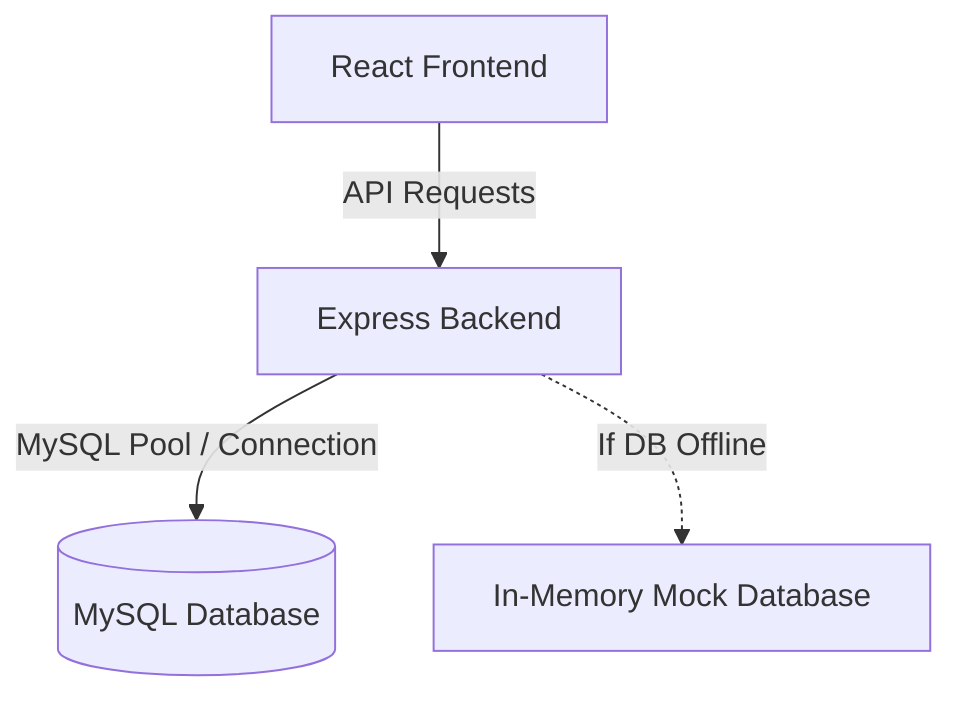

# HungryHub Full-Stack Implementation Plan

HungryHub is a premium, modern food delivery platform featuring a luxury UI/UX (Glassmorphism, dark/light theme, rich animations), full responsiveness, real-time interactions, and a comprehensive admin control center.

---

## User Review Required

> [!IMPORTANT]
> **Database Configuration & Fallback Mechanism**
> To ensure the application is immediately testable and functional out-of-the-box, the Express.js backend will run in a **Dual-Mode** configuration:
> 1. It attempts to connect to your local or production MySQL database using the credentials in `backend/.env`.
> 2. If MySQL is not running or credentials are missing, the server will **gracefully fall back to an In-Memory Database** initialized with rich mock data. It will log a notice and continue serving the frontend, allowing all 14 pages and CRUD functionalities (search, categories, order placement, wallet transactions, cart operations, coupons, reviews, and admin analytics updates) to work seamlessly.

> [!NOTE]
> **Real-Time Order Tracking & Mocking**
> Since local setups might not have full web-sockets setup, we will implement standard REST APIs alongside Socket-like simulated intervals on the frontend for smooth live-updating tracking, providing a premium animated dashboard (order received -> kitchen -> rider -> delivered).

---

## Open Questions
- **Google OAuth Credentials**: We will configure the backend and frontend to use Google Sign-In button placeholders. If you have valid client IDs, they can be configured in `.env` files. Is this approach acceptable?
- **Payment Mocking**: For checkout, we will support Wallet-based payments (which will actually deduct from the user's wallet balance database), card checkout, and COD (Cash on Delivery). The card checkout will display a premium checkout card modal that simulates a payment gateway processor.

---

## Proposed Changes

We will create a full-stack project in `c:\HungryHub` with a frontend (Vite/React) and backend (Node/Express).



### Folder Structure
```
c:\HungryHub/
├── package.json               # Root scripts to run both frontend and backend
├── README.md                  # Quickstart documentation
├── backend/
│   ├── package.json
│   ├── .env.example
│   ├── server.js              # Entrypoint
│   ├── db/
│   │   ├── connection.js      # Dual-mode DB wrapper (MySQL + In-memory fallback)
│   │   ├── schema.sql         # Table definitions
│   │   └── seed.sql           # Initial restaurant, menu, user data
│   ├── routes/
│   │   ├── auth.js            # User signup, login, profile, wallet
│   │   ├── restaurants.js     # Fetching restaurants, categories, menu items, reviews
│   │   ├── orders.js          # Cart checkout, status tracking, coupon validation
│   │   └── admin.js           # Analytics, dashboard metrics, CRUD operations
│   └── middleware/
│       └── auth.js            # JWT verification middleware
└── frontend/
    ├── package.json
    ├── vite.config.js
    ├── tailwind.config.js
    ├── index.html
    └── src/
        ├── index.css          # Premium animations, custom gradients, glassmorphism CSS
        ├── main.jsx
        ├── App.jsx            # Router and ThemeWrapper
        ├── context/
        │   ├── AuthContext.jsx # Holds user session & wallet state
        │   └── CartContext.jsx # Handles checkout list, wishlist, coupon active state
        ├── components/        # Reusable UI elements (Navbar, Footer, RestaurantCard, Custom Toast, ReviewCard)
        └── pages/             # All 14 pages listed in the requirements
```

---

### Component & Page Descriptions

1. **Home Page**: Majestic landing page with parallax hero, trending categories, top-rated carousel, promotion banners, and curated recommendation collections.
2. **Restaurants Page**: Search engine with dual-view grids, sorting (price, delivery speed, ratings), food category filters, and active deals search.
3. **Restaurant Details Page**: Elegant banner with info, visual food menu groups, veg/non-veg toggle, custom search inside menu, reviews and rating panel.
4. **Menu Page**: Directly integrated inside Restaurant Details with quick category jumps.
5. **Cart Page**: Beautiful slide-over list or full-view breakdown showing items, quantities, price adjustments, subtotal, delivery charges.
6. **Checkout Page**: Secure checkout flow with:
   - Wallet Payment (real-time balance deduction)
   - Simulated Card Payment
   - Cash on Delivery
   - Active Coupon Input (validates custom percentage/fixed codes like `HUNGRY50`, `FREESHIP`)
7. **Order Tracking Page**: Real-time status tracker with animated timeline steps, map-like display, rider status, and simulated live ETA updates.
8. **User Profile Page**: User account editor, transaction list, and saved delivery addresses.
9. **Wallet Page**: Add money interface, wallet balance display, and structured transaction history (credits/debits).
10. **Login Page**: Glassmorphic card login, credentials validation, and Google Login simulation.
11. **Signup Page**: Registration card with inline validation rules.
12. **Contact Us Page**: Support form with animations.
13. **About Us Page**: Sleek presentation of the brand story, core values, and developer credits.
14. **Admin Dashboard**: Control center with:
    - Statistics metrics (Total Sales, Orders, Active Users, Commissions)
    - Recharts graphs (Monthly Revenues, Order Volume)
    - Orders Table (with status updates like 'preparing', 'out_for_delivery')
    - Restaurant / Menu Item CRUD panels
    - Coupon Management panel

---

## Deployment Strategy (Live Server Hosting)

> [!IMPORTANT]
> **Is it the right time to deploy? YES.**
> Deploying now is the correct next step because it allows us to test real-world scenarios (network latency, live MySQL database connections, and WebSockets) and provides a secure `https://` environment required by third-party APIs like Razorpay and Google OAuth.

To launch HungryHub as a live SaaS product, we will use a **Multi-Tier Cloud Deployment Architecture**:

### 1. Database Tier (MySQL)
- **Option A (Recommended):** **Aiven / PlanetScale / AWS RDS**
  - We will provision a managed MySQL database in the cloud.
  - The `schema.sql` and `seed.sql` will be executed there.
  - *Why?* Better security, daily backups, and no need to manage the DB server manually.

### 2. Backend API & WebSockets (Node.js)
- **Option A:** **Render.com (Web Service)**
  - Easiest setup for Node.js + Socket.io with automatic HTTPS.
  - Connects directly to our GitHub repo to auto-deploy on every `git push`.
- **Option B:** **AWS EC2 / DigitalOcean Droplet (Docker)**
  - We will SSH into a Linux VPS, install Docker, and run our `docker-compose.yml`.
  - *Why?* More control over the server environment.

### 3. Frontend Web App (React/Vite)
- **Platform:** **Vercel / Netlify**
  - We will connect the GitHub repository to Vercel.
  - Vercel will automatically build the React app (`npm run build`) and host it on a global CDN.
  - *Why?* Lightning fast, free for frontend, auto-SSL, and continuous integration.

## Open Questions for Deployment
1. **Cloud Provider Preference**: Do you want to use simpler Platform-as-a-Service (Render + Vercel) or do you have an AWS/DigitalOcean account where you want everything hosted?
2. **Domain Name**: Do you already own a domain name (like `hungryhub.com`) that we should connect?

---

## Verification Plan

### Automated Tests
- Server verification: Check health endpoint `/api/health` returns operational status.
- Frontend compilation: Verify that React builds successfully (`npm run build`).

### Manual Verification
1. Launch the backend server in dev mode: `npm run dev:backend`
2. Launch the frontend React app in dev mode: `npm run dev:frontend`
3. Open a browser and test the following user flows:
   - **Login/Signup**: Sign up a user, verify JWT token is stored, check credentials auth.
   - **Order Lifecycle**: Browse restaurants, search, filter, add items to cart, apply coupon, checkout using Wallet (see wallet funds deduct), transition to Order Tracking, view mock real-time progression.
   - **Wallet Management**: Add credit to wallet, verify history update, use wallet to pay.
   - **Admin Powers**: Log in as admin, edit orders status, add coupons, check live charts updates.
