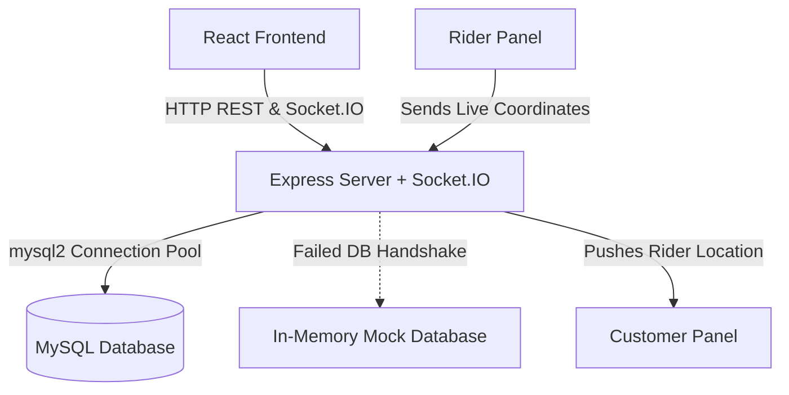

# HungryHub SaaS Platform Walkthrough

HungryHub is a premium, enterprise-grade food delivery SaaS platform. This document highlights the visual screens, sandbox profiles, and developer evaluation tools created.

---

## 1. Credentials Directory (Sandbox Mode)

For quick local verification without manual registrations, use these sandbox profiles on the [Login Screen](file:///c:/HungryHub/frontend/src/pages/Login.jsx):

| Persona / Role | Email Account | Passwords | Features Exposed |
| :--- | :--- | :--- | :--- |
| **Sarah Jenkins (Customer)** | `customer@hungryhub.com` | `password123` | Cart operations, Wallet checkout, coupons validation, real-time map GPS tracking. |
| **Chef Giovanni (Owner)** | `owner@hungryhub.com` | `password123` | Dish addition CRUD, preparation workflow status updates, weekly Recharts. |
| **Alex Rider (Rider)** | `rider@hungryhub.com` | `password123` | Availability toggling, Accept pickups, driving simulator location emitter. |
| **Super Admin** | `admin@hungryhub.com` | `password123` | Users directory controls, custom coupon creator, downloadable orders CSV audits. |

---

## 2. Key Modules & Technical Implementation

### Core Components
1. **[Navbar](file:///c:/HungryHub/frontend/src/components/Navbar.jsx)**: Implements glassmorphism styling, bubble badges, and a custom **Roles Sandbox selector dropdown** that logs into any sandbox role immediately.
2. **[Database Pool with Fallback Simulator](file:///c:/HungryHub/backend/config/db.js)**: Runs in dual mode. If local MySQL is offline, it activates a regex-driven parser that mimics standard SQL queries inside JS RAM Arrays.
3. **[GPS Driver Simulation Engine](file:///c:/HungryHub/frontend/src/pages/RiderDashboard.jsx)**: Interpolates rider positions between the kitchen and drop location. When active, it emits coordinates to the Socket.IO server.
4. **[Razorpay Checkout Emulator](file:///c:/HungryHub/frontend/src/components/RazorpayModal.jsx)**: Features card detail captures, security certificates indicators, and options to simulate payment success/failure.

---

## 3. Operations Verification Script

To preview the complete order tracking pipeline:
1. Log in to the **Rider Partner Dashboard** (using the Roles Sandbox toolbar) and toggle availability status to **Online**.
2. Log in as **Customer**, browse menus, add items (e.g. woodfired pizza), and apply coupon code `HUNGRY50`.
3. Proceed to Checkout, select **HungryHub Wallet**, and confirm. Your wallet funds are deducted, and you are directed to the live map.
4. Open a separate tab/window, log in as **Chef Owner**, and click **Accept & Prepare** on the new order.
5. Once cooked, click **Ready for Rider**.
6. Switch back to your **Rider** console tab. The order will appear under available pickups. Click **Accept & Dispatch**.
7. Click **Start Driving GPS** to simulate the courier vehicle traveling. Switch to the **Customer** tracking tab to watch the rider vehicle icon move in real-time.
8. Once the rider arrives (progress bar reaches 100%), click **Mark as Delivered**. Commission fees are automatically credited to the rider's wallet, and payouts are finalized for the restaurant owner.
